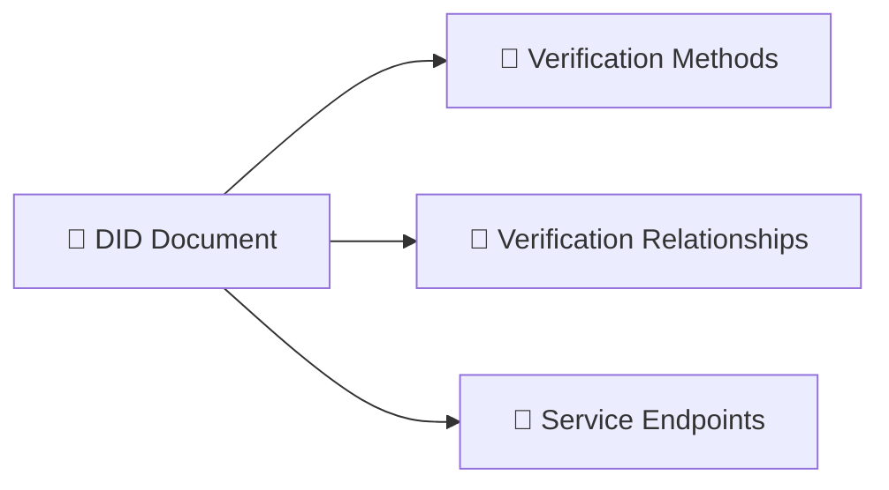
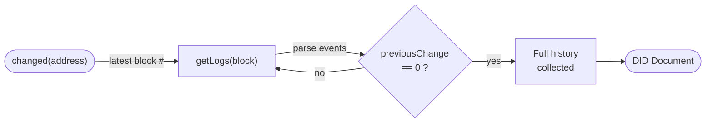
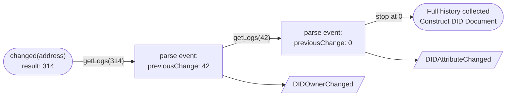
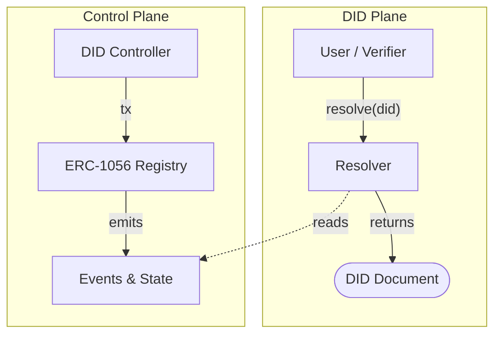

<!-- .slide: class="title-slide" -->

# How `did:ethr` Works

A story-driven deep explainer.

`left / right`: move through the story  
`up / down`: go deeper into the current idea

---

# What's `ethr` ⟠ ?

`did:ethr` is a DID method that uses the **Ethereum blockchain** to update and resolve DIDs.

Ethereum is a global, shared, virtual machine.<br/>
Anyone can **read** the state of the machine (for free) and **write** to it (with some cost).<br/>
It uses programs called **smart contracts** to define rules for how state can be stored and updated.<br/>
Updates to the machine are made by transactions, which require a signature from a key pair and a fee called **gas**.<br/>

--

## Transactions? 🔑→📒

A transaction is a **signed message** that tells the Ethereum machine to **update its state** according to some rules.

- It has a sender (the signer) and a recipient (a smart contract or another account).
- It can include data (e.g. function calls and arguments) and a fee (gas).
- Once included in a **block**, it becomes part of the **immutable history** of the blockchain.

--

## Accounts 👛🔑?

There are two types of accounts on Ethereum:

* **Externally Owned Accounts (EOAs)**:
    - controlled by a private key
    - can sign and send transactions

* **Smart Contract Accounts**:
    - controlled by code
    - can execute logic when their functions are called by transactions
    - can call other contract functions

Both types of accounts have an _address_, in the same address space.

--

## Smart Contracts 📜⚙️?

A smart contract is a **program** that lives on the Ethereum virtual machine.

It defines rules (functions) for how its state can be read or updated.

When a **transaction** calls a function on the contract, the contract executes its code and **updates** its state
accordingly.

Smart contract functions can emit **events** that are recorded in the **transaction logs**.

Some functions can be read-only (view/pure) and do not require a transaction or gas to call.

Functions can **call other functions** within the same contract or in other contracts.

---

# Your wallet address is your DID

`did:ethr` lets an Ethereum account, or its corresponding public key act as
a [Decentralized Identifier](https://www.w3.org/TR/did-1.0/).

- Any Ethereum address or public key has an implicit DID Document, with itself as controller.
- This DID Document can be updated by the controller by sending transactions to
  a [ERC1056 registry contract](https://github.com/uport-project/ethr-did-registry/blob/master/contracts/EthereumDIDRegistry.sol).
- A resolver assembles a DID document from Ethereum state and history.
- The controller can rotate.

~~

I mean it, [manage your DIDs here](https://mirceanis.xyz/ethr-manager) while you follow along.

--

## Role of the Resolver

The resolver looks at the **history** of changes to figure out:

- if the DID has had **any updates**
- which updates are DID updates vs unrelated transactions
- which **keys and service** endpoints are **currently valid**
- which address is the **current controller**

--

## Subject vs Controller

- The DID subject is whatever the DID identifies
- The controller is whoever can change the DID state
- With `did:ethr` those start out aligned (like `did:key`, or `did:pkh`)
- **They do not have to stay aligned forever**

--

## Controller authority

By design, the controller address always appears in the DID Document with the suffix `#controller`.

* no supplementary transaction needed to add it as a verification method
* it is always present, even if the DID has no history of updates
* updates to the controller are reflected in the DID Document as changes to the `blockchainAccountId` of the
  `#controller` method

---

# Not a Profile Page!

The DID document is NOT meant to be a biography or claims bundle.

It mostly answers:

- which keys are valid
- which verification relationships they belong to
- which service endpoints are currently published



--

## Blockchains are **append-only**

This means history is **always there**, even if you revoke it.

**Personal data** can be removed from the DID document, but the fact that it was there at some point **will always be visible**.

---

# Meet Our First `did:ethr`

We start with the simplest form, an address prefixed with `did:ethr:`:

[ `did:ethr:0x1234567890abcdef1234567890abcdef12345678`](https://dev.uniresolver.io/#did:ethr:0x1234567890abcdef1234567890abcdef12345678)

Read it as:

- DID scheme: `did`
- DID method: `ethr`
- method-specific identifier: `0x1234567890abcdef1234567890abcdef12345678` - an Ethereum address

--

## DID Document

For this particular DID, the resolver returns this DID document:

```json
{
  "id": "did:ethr:0x1234567890abcdef1234567890abcdef12345678",
  "verificationMethod": [
    {
      "id": "did:ethr:0x1234567890abcdef1234567890abcdef12345678#controller",
      "type": "EcdsaSecp256k1RecoveryMethod2020",
      "controller": "did:ethr:0x1234567890abcdef1234567890abcdef12345678",
      "blockchainAccountId": "eip155:1:0x1234567890AbcdEF1234567890aBcdef12345678"
    }
  ],
  "authentication": [
    "did:ethr:0x1234567890abcdef1234567890abcdef12345678#controller"
  ],
  "assertionMethod": [
    "did:ethr:0x1234567890abcdef1234567890abcdef12345678#controller"
  ]
}
```

---

# Creation Without Registration

There is no "create DID" operation for `did:ethr`.

DIDs exist as soon as you can refer to them.

- If you control an Ethereum key pair, you can already refer to it as `did:ethr:...`.
- On-chain activity starts only when you want the DID to evolve.
- That means creation is private and has no upfront gas cost.

[Click here to resolve this imaginary DID: `did:ethr:0x1234567890abcdef1234567890abcdef12345678`](https://dev.uniresolver.io/#did:ethr:0x1234567890abcdef1234567890abcdef12345678)

--

## What Exists Before Any Updates

Even with no registry history, resolution still returns a minimal DID document.

- It includes a `#controller` verification method.
- That method is referenced from `authentication` and `assertionMethod`.

--

## Why This Matters

- No registration ceremony
- No registry write just to exist
- First transaction only happens when control or data changes
- **Infinitely scalable creation**

---

# Role of the Registry

The Ethereum DID Registry is a smart contract that acts as a **shared source of truth** for DID state and history.

It provides a set of _functions_ and defines a set of _events_<br/>
that allow **DID controllers** to **publish updates**<br/>
and **resolvers** to construct the **DID document**.

```solidity
// simplified interface:

contract EthereumDIDRegistry {
    mapping(address => address) public owners;
    mapping(address => uint) public changed;

    function changeOwner(address identity, address newOwner) public;

    function identityOwner(address identity) public view returns (address);

    function setAttribute(address identity, bytes32 name, bytes value, uint validity) public;

    function revokeAttribute(address identity, bytes32 name, bytes value) public;

    event DIDOwnerChanged();
    event DIDAttributeChanged();
}
```

In terms of Object-Oriented Programming, you can think of the registry as a class instance<br/>
that defines the state and behavior of DIDs on a globally accessible virtual machine called Ethereum.

[Here](https://github.com/uport-project/ethr-did-registry/blob/master/contracts/EthereumDIDRegistry.sol) you can inspect the full 132 lines of contract code.

--

## How does an event look like?

When a DID controller successfully calls `changeOwner`, `setAttribute`, etc, the registry emits an event that looks like
this:

```json5
{
  "event": "DIDOwnerChanged",                               // the type of change
  "identity": "0x1234567890abcdef1234567890abcdef12345678", // the DID subject
  "owner": "0xabcdef1234567890abcdef1234567890abcdef12",    // new controller address
  "previousChange": 42                                      // block number of the previous change for this subject
}
```

[Here](https://etherscan.io/tx/0xf436f2f55dd299f35e7ddb881d2499a02cc248a1346280b0202e783a5e4623bf#eventlog) is what a
live event looks like on a block explorer.

--

## Why Events?

Events were chosen as the primary source of truth for DID updates because:

- They are **cheap to write** (emit) compared to storing data in contract state.
- They are **easily accessible** to resolvers via `getLogs`
- They provide a **linked history** through the `previousChange` field, enabling efficient resolution without scanning
  the entire chain.
- They allow for a **flexible data model**

---

# Resolver Walkthrough

The DID document is *NOT stored as a JSON file*.

The resolver builds it at resolve time by walking the identity history backward:

1. Ask the registry for the latest block where something `changed`.
2. Get the events at that block and find out what changed and where to look next (`previousChange`).
3. **Follow** each event's `previousChange` pointer backward, collecting events at every relevant block.
4. Once the **full history** is available, compute the active keys, and services.



--

## The Two Important Reads

* `changed(address)` tells the resolver when the latest change happened (block number).
* `getLogs(address, block)` lets the resolver read the relevant events at that block and find out
    * what changed
    * where to look next.

This avoids scanning the whole chain from genesis.

--

## The Event Walk 

The resolver interprets three event families:

- `DIDOwnerChanged`
- `DIDDelegateChanged`
- `DIDAttributeChanged`

Each event has a `previousChange` field that points to the block number of the previous change.<br/>
The history is linked block-to-block through `previousChange`.

---

# Minimal DID Document

When `changed(0xAddress)` returns `0`,<br/>it means no updates have ever happened.

The resolver returns the **implicit DID document**:

```json
{
  "id": "did:ethr:0xAddress",
  "verificationMethod": [
    {
      "id": "did:ethr:0xAddress#controller",
      "type": "EcdsaSecp256k1RecoveryMethod2020",
      "controller": "did:ethr:0xAddress",
      "blockchainAccountId": "eip155:1:0xAddress"
    }
  ],
  "authentication": [
    "...#controller"
  ],
  "assertionMethod": [
    "...#controller"
  ]
}
```

--

## A DID with updates

Example DID with 2 updates at blocks 314 and 42:



--

## DID Document with updates

```json5
{
  "id": "did:ethr:0xAddress",
  "verificationMethod": [
    {
      "id": "did:ethr:0xAddress#controller",
      "type": "EcdsaSecp256k1RecoveryMethod2020",
      "controller": "did:ethr:0xAddress",
      "blockchainAccountId": "eip155:1:0xNewOwnerAddress" // <-- from DIDOwnerChanged at block 314
    },
    {
      "id": "did:ethr:0xAddress#delegate-1",
      "type": "EcdsaSecp256k1VerificationKey2019",
      "controller": "did:ethr:0xAddress",
      "publicKeyHex": "02abcdef1234567890abcdef1234567890abcdef1234567890abcdef1234567890" // <-- from DIDAttributeChanged at block 42
    }
  ],
  "authentication": [
    "...#controller"
  ],
  "assertionMethod": [
    "...#controller",
    "did:ethr:0xAddress#delegate-1" // <-- from DIDAttributeChanged at block 42
  ]
}
```

[Resolve a real DID with updates](https://dev.uniresolver.io/#did:ethr:0x077d0d997341753523AA0a1ba4639b3b06C019A8)

---

# `did:ethr` is network-scoped

So far we used the simplest form, which defaults to Ethereum mainnet.

Now we make the blockchain network explicit:

`did:ethr:sepolia:0x1234567890abcdef1234567890abcdef12345678`
<br/>(Sepolia is an ethereum testnet)

That is a _different DID_, with different resolution history.
Effectively an independent DID that happens to share most of method-specific identifier.

--

## Why Network Scope Matters

- The same address can exist on many EVM networks.
- `did:ethr` needs a way to say which registry and chain to use.
- Network scope changes which events and state count during resolution.
- Different networks have different costs and security properties.
- DIDs will resolve to different DID Documents when different chains or registries are used.

---

<!-- .slide: class="resolver-slide" -->

# Try it out!

Enter a `did:ethr` below to resolve it live.
<div class="did-resolver">
  <div class="did-resolver-form">
    <input class="did-resolver__input" type="text" value="did:ethr:0xb9c5714089478a327f09197987f16f9e5d936e8a" onfocus="this.select()" />
    <button class="did-resolver__btn">Resolve</button>
  </div>
  <div class="did-examples">
    <span class="did-examples__label">Examples:</span>
    <button class="did-example" data-did="did:ethr:0xdca7ef03e98e0dc2b855be647c39abe984fcf21b">mainnet (no history)</button>
    <button class="did-example" data-did="did:ethr:0x3c865a75d98E711A472130b0CF42F393FF87834e">mainnet (with history)</button>
    <button class="did-example" data-did="did:ethr:gno:0xEd4aBF0BbA69C63e2657CF94693CC4a9070896a2">gnosis chain (with history)</button>
    <button class="did-example" data-did="did:ethr:sepolia:0xf61c81096c96f97e95ac52a570966195ad6c90dd">sepolia testnet (with history)</button>
  </div>
  <div class="did-resolver__result"></div>
</div>


---

# What Can Change Over Time

`did:ethr` is simple when untouched.

It gets interesting once the DID evolves.

- control can move to a new owner
- extra keys can appear or get revoked
- service endpoints can be published or removed

[Connect your wallet and update your DID](https://mirceanis.xyz/ethr-manager) to see how the DID document changes in response to updates.

--

## Controller Changes

By default, the identifier controls itself.

Later, control can move somewhere else:

- another externally owned account (a key pair)
- a smart contract
- a proxy, multisig, delegator, or any other flexible control model

--

## Attributes

The registry contract supports a flexible attribute model that allows the controller to publish arbitrary key-value pairs on-chain.
Resolvers can interpret these attributes as they see fit, but the most common use cases are:
- adding verification methods (keys)
- adding service endpoints

For the purpose of resolving DIDs, attribute changes that don't refer to DID semantics are ignored.

The registry can be used as a general-purpose on-chain identity management system, not just for DIDs.
( The Graph protocol used it as such in the past ).

--

## Delegates

The registry contract supports a delegation mechanism that allows the controller to delegate some authority to other addresses.
These delegates can be inspected on-chain, by other contracts, or off-chain by resolvers.

In the Ethereum ecosystem, this pattern has evolved and more complex delegation models have emerged (e.g. ERC-1271, ERC-7710, etc),
but the basic idea of on-chain delegation is still supported by the registry and can be used by resolvers.

Valid delegate addresses are included in the DID document as verification methods, and can be used for authentication or assertion.

---

# Revocation and Expiry

Attributes and delegates expire automatically.
- When an attribute or delegate is set, the controller specifies a **validity period** (in seconds).
- Once the validity period elapses, the attribute or delegate is **considered revoked** and is **not included in the resolved DID document**.
- The **resolver checks the validity** period to determine if an attribute or delegate is still **active** or **expired**.

Attributes and delegates can also be revoked manually by the controller before their validity period elapses.

The resolver does not care about the reason for revocation, only about the current validity status.
In the case of `did:ethr`, revocation is actually just a special case of expiry, where the controller sets the validity period to 0.

---

# Deactivation

`did:ethr` uses the null address to signal deactivation.

To deactivate a DID, the controller calls `changeOwner` with `0x0000000000000000000000000000000000000000` as the new owner.

The resolver treats a DID with a null owner as deactivated, effectively revoking all other verification methods and service entries.

The registry contract does not have a specific "deactivate" function; it's not needed.

The null address cannot send transactions or control the DID, so it effectively locks the DID in a deactivated state.

---

# Gas Costs

Updating a DID requires sending a transaction to the registry contract, which incurs gas costs.
The cost depends on the type of update (e.g. changing owner, adding/revoking an attribute) and **the current gas price** on the respective network.
The cost is low, but still exists and can be a barrier for some users or use cases.

For this reason, the `did:ethr` registry contract supports **meta-transactions**, where a third party pays the gas on behalf of the user.

This happens without compromising custody or security, as the user must still sign the update with their private key.

--

## Censorship Resistance

At most, the gas payer can choose not to publish a transaction.
They cannot prevent the user from publishing it themselves, or from choosing another gas payer.

The user can also choose to publish the transaction directly, without a gas payer, if they have enough gas tokens in their `#controller` account.

---

# Using public keys as the identifier

`did:ethr` also supports using a public key as the method-specific identifier instead of an address.

This allows for a more direct mapping between the DID and the cryptographic material that controls it, without the indirection of an address.

The registry still uses the corresponding address of that public key as `controller`.

--

<!-- .slide: class="resolver-slide" -->

# Resolve a public key DID:

<div class="did-resolver">
  <div class="did-resolver-form">
    <input class="did-resolver__input" type="text" value="did:ethr:gno:0x03aa3149ef3e197d73edc6008cbd324814509d04eaf59881d4db16793858eecc06" onfocus="this.select()" />
    <button class="did-resolver__btn">Resolve</button>
  </div>
  <div class="did-resolver__result"></div>
</div>

---

# DID Plane vs Control Plane

`did:ethr` mostly separates the DID plane (the identifier and its DID document) from the control plane (the registry and its functions).

The DID plane is what users interact with when they resolve a DID or use it in a verifiable credential.

The control plane is what DID controllers interact with when they want to update their DID state.




This separation allows for more flexibility and composability, as different control models can be used for different DIDs.

--

## Why this separation matters

- It allows for more flexible control models (e.g. smart contract wallets, multisigs, etc) without changing the resolver logic.
- It frees the resolver from having to secure the history of the DID. Security is delegated to the decentralized nodes running the blockchain network.
- It allows for different implementations of the registry (e.g. on different chains) without affecting the DID plane.
- It enables the possibility of multiple resolvers with different performance or security tradeoffs, as they all rely on the same control plane.
- It allows for the possibility of multiple DID planes (e.g. different identifier formats) that can still use the same control plane.

---

# Tradeoffs

`did:ethr` gets a lot from Ethereum:

- self-management
- auditability
- flexible control models
- composability with other on-chain control models

But it also inherits some tradeoffs:

- public history
- resolver dependence on RPC access
- gas costs when updates happen

---

# Links

* [did:ethr spec](https://github.com/decentralized-identity/ethr-did/blob/master/doc/did-method-spec.md)
* [ethr-did-resolver reference implementation](https://github.com/decentralized-identity/ethr-did-resolver)
* [ethr-did-registry contract](https://github.com/uport-project/ethr-did-registry)
* [source of this site](https://github.com/mirceanis/ethr-intro)
* [DID manager](https://mirceanis.xyz/ethr-manager/)